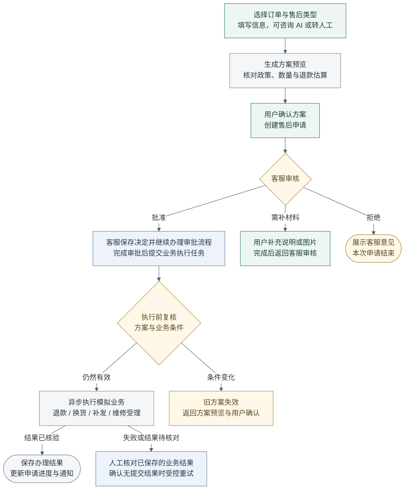

# 电商智能售后服务台项目流程

主要申请、审批与执行路径；咨询按需进入，业务写入仍须确认、审批与执行复核。

```mermaid
%%{init: {"theme":"base","layout":"dagre","look":"classic","fontFamily":"Microsoft YaHei, sans-serif","themeVariables":{"edgeLabelBackground":"#ffffff","lineColor":"#52616b"},"flowchart":{"wrappingWidth":340,"nodeSpacing":35,"rankSpacing":35,"curve":"linear"}}}%%
flowchart TB
    apply["选择订单与售后类型<br/>填写信息，可咨询 AI 或转人工"]
    apply --> preview["生成方案预览<br/>核对政策、数量与退款估算"]
    preview --> confirm["用户确认方案<br/>创建售后申请"]
    confirm --> review{"客服审核"}
    review -->|批准| approved["客服保存决定并继续办理审批流程<br/>完成审批后提交业务执行任务"]
    review -->|需补材料| materials["用户补充说明或图片<br/>完成后返回客服审核"]
    review -->|拒绝| rejected(["展示客服意见<br/>本次申请结束"])
    approved --> check{"执行前复核<br/>方案与业务条件"}
    check -->|仍然有效| execute["异步执行模拟业务<br/>退款 / 换货 / 补发 / 维修受理"]
    check -->|条件变化| refresh["旧方案失效<br/>返回方案预览与用户确认"]
    execute -->|结果已核验| result(["保存办理结果<br/>更新申请进度与通知"])
    execute -->|失败或结果待核对| reconcile["人工核对已保存的业务结果<br/>确认无提交结果时受控重试"]

    classDef user fill:#edf6f2,stroke:#2b7c69,color:#203f37;
    classDef staff fill:#eef3fa,stroke:#587aa3,color:#24384d;
    classDef system fill:#f5f6f8,stroke:#788596,color:#293542;
    classDef decision fill:#fff7e7,stroke:#a78949,color:#594725;
    class apply,confirm,materials user;
    class approved,reconcile staff;
    class preview,execute,result system;
    class review,check,refresh,rejected decision;
```
